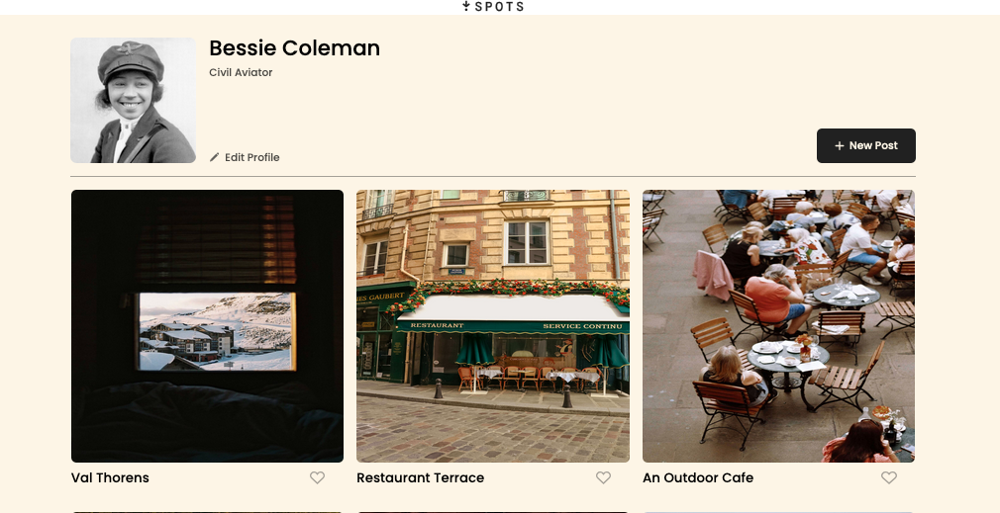
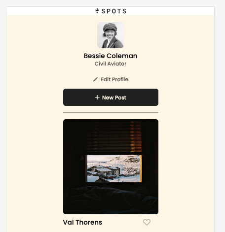
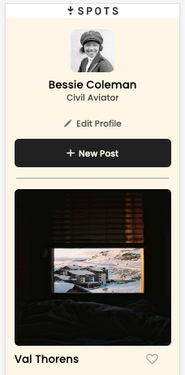

# Project 3: Spots

- This project is my first real attempt at an adaptive webpage, pulling together my new skills in HTML & CSS. The goal for this project was to create a grid layout that would adapt to the screen size of any device (Desktop, Tablet, or Phone).

- I used grid layout in order to change the columns and rows that are seen in different screen sizes. I also used media queries to adjust the orientation of the profile and card contents for different screen sizes and when the size is changed on any device.

1. Here is the Desktop view at 1440px.
   

2. Here is the Tablet view, that adapts at 627px.
   

3. Here is the mobile view that will adapt until 320px.

   

### Check It Out! :)

- I have prepared a video to explain how the webpage adapts here (after first code review)

- Here is the link to the webpage: https://cam-williams-1.github.io/se_project_spots/
